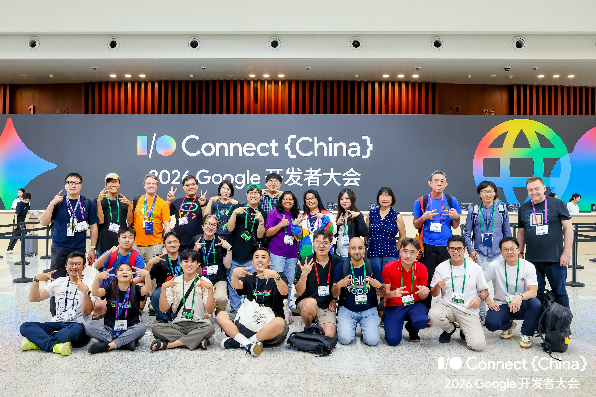
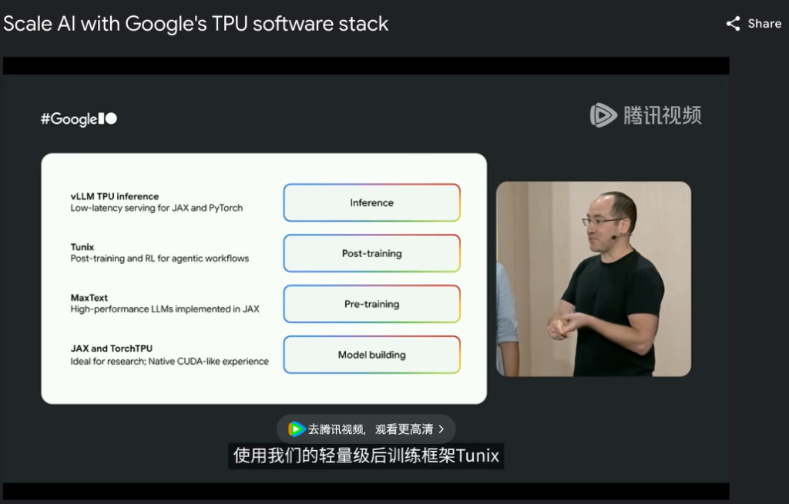
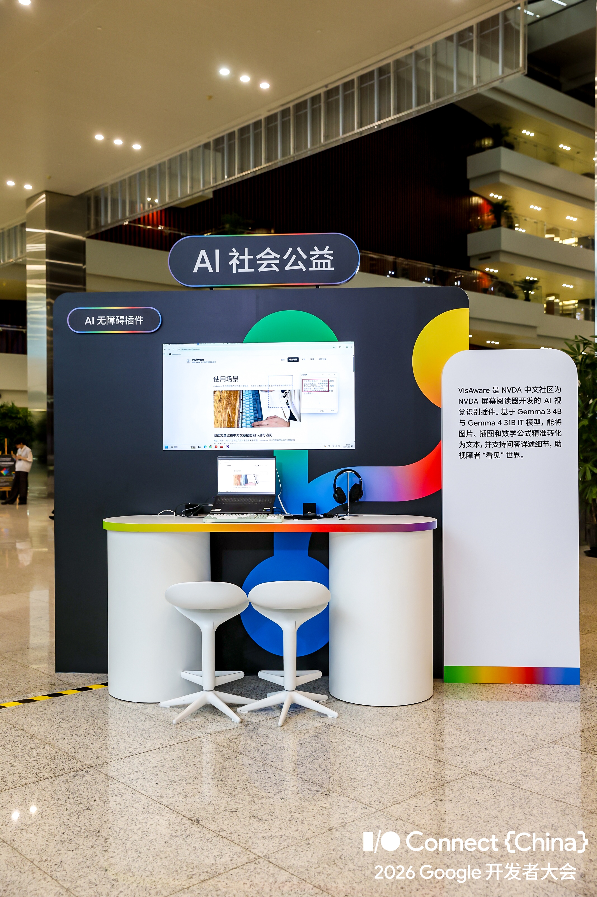
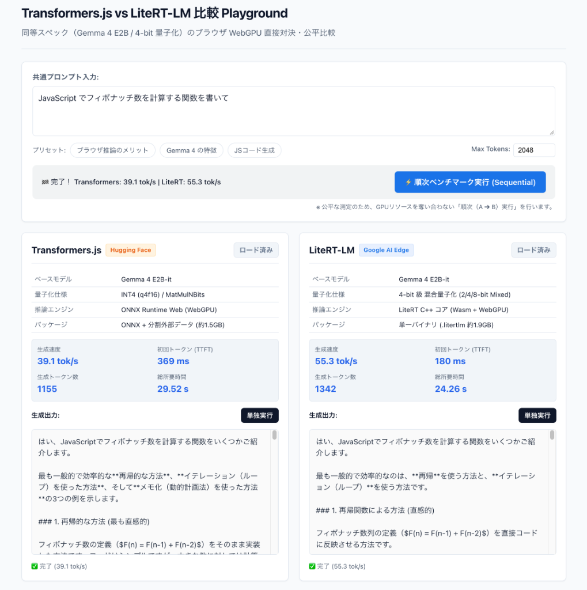

<!-- 
_class: lead
-->

# Transformers.js と LiteRT をつかって<br>Gemma をブラウザで動かそう

### Gemma Meetup 2026 (GDG Tokyo)

太田 満久（おおたまん）  
[@ohtaman](https://x.com/ohtaman) / Ubie Lab 所長, GDE (AI / Cloud AI)

<div class="title-qr-box">
  
  <div class="qr-label">スライド資料</div>
</div>

---

## 1. 自己紹介

<div class="profile-layout">
<div class="profile-info">

<div class="profile-name">おおたまん</div>

- **所属**:
  - Ubie. Inc. (Ubie Lab 所長)
  - Google Developer Expert (AI / Cloud AI)
- **活動**:
  - 数理最適化コミュニティ Casual Optimization
  - 書籍執筆
- **X**: [@ohtaman](https://x.com/ohtaman)
- **GitHub**: [github.com/ohtaman](https://github.com/ohtaman)

</div>
<div class="profile-side">

<div class="profile-photo">
  
</div>

<div class="profile-qr-card">
  
</div>

</div>
</div>


---

## 2-1. Google I/O Connect China 2026

<p class="lead-msg">中国・APAC のデベロッパーに向けた Google I/O の地域旗艦イベント</p>

<div class="split">
<div class="left" style="flex: 1.05;">

- **開催**: 2026.8.12-13 上海世博中心
- Google I/O の中国版イベント
- 現地・APACのデベロッパー中心に 2,000 名以上が参加

<div class="inline-qr-card">
  
  <div class="qr-label">イベント公式サイト</div>
</div>

</div>
<div class="right" style="flex: 0.95;">

<div class="photo-box contain">
  
  <span class="caption">I/O Connect China 2026 メイン会場 集合写真</span>
</div>

</div>
</div>

---

## 2-2. 「エッジ推論」と「オープンモデル」の重視

<p class="lead-msg">AndroidとWebで6割。エッジ推論やオープンモデルのセッションが多い</p>

<div class="compact">

| 比較項目 | Google I/O (Mountain View / 72枠) | Google I/O Connect China (86枠) |
|---|---|---|
| **カテゴリ構成** | ・Android: 43% (31枠)<br>・Cloud: 21% (15枠)<br>・AI: 19% (14枠)<br>・Web: 17% (12枠) | ・Android: 40% (34枠)<br>・Web: 21% (18枠)<br>・AI: 21% (18枠)<br>・Cloud: 19% (16枠)<br>👉 **Android + Web で約 60%** |
| **主な AI 関連トピック** | ・Gemini API / Google AI Studio<br>・Vertex AI / Workspace MCP<br>・Android Studio / DevTools AI | ・Gemma (オープンモデル)<br>・LiteRT / LiteRT-LM (エッジ推論)<br>・TPU ソフトウェア (MaxText / vLLM) |
| **推論・適用の方向性** | クラウド API 連携、開発ツールへの AI 統合 | **端末内（On-device）推論、オープンモデル活用** |

<div class="footnote">
※ 共通の主要技術分野（Android / Cloud / AI / Web）のセッションを対象に集計（対談・基調等を除く）
</div>

</div>

---

## 2-3. Scale AI with Google's TPU software stack

<p class="lead-msg">モデル構築から学習・推論まで、ソフトウェアスタックが体系化されている</p>

<div class="split compact">
<div class="left" style="flex: 1.05;">

- **セッション概要**:
  - Google TPU を支えるオープンソース群の全体像を解説
- **モデルライフサイクルを支える 4 つの層**:
  - **Inference**: **vLLM TPU**（低遅延推論）
  - **Post-training**: **Tunix**（事後学習・LoRA・RL）
  - **Pre-training**: **MaxText**（事前学習）
  - **Model building**: **JAX / TorchTPU**

</div>
<div class="right" style="flex: 0.95;">

<div class="photo-box contain" style="height: 330px;">
  
  <span class="caption">セッション: Scale AI with Google's TPU software stack</span>
</div>

</div>
</div>

---

## 2-4. 展示ブース: 多様なデバイスで動く Gemma のデモ

<p class="lead-msg">モバイル、モバイル、ARメガネなど、多様なデバイスで Gemma のデモが展示されていた</p>

<div class="split compact">
<div class="left" style="flex: 1.05;">

- **視覚障害者向け画面読み上げ「VisAware」**
  - スクリーンリーダー用のAI視覚認識プラグイン
  - 画面内の画像・図表をGemmaで解説
- **in BrowserでのGemmaの利用例**
  - Transformers.js や LiteRT-LM Web API
- **その他多様なデバイスでの活用**
  - ブラウザやスマホ、各種エッジデバイスなど、様々なデバイスで Gemma を実行

</div>
<div class="right" style="flex: 0.95;">

<div class="photo-box contain" style="height: 380px;">
  
  <span class="caption">会場展示: Gemma 活用プラグイン VisAware ブース</span>
</div>

</div>
</div>

---

## 3. ブラウザで動かす理由

<p class="lead-msg">手軽な配布、ブラウザ機能の利用、推論コストのユーザー端末への転嫁</p>

- **① 配布の容易さ**
  - Python や環境構築が不要。URL を開くだけで即利用可能。
- **② ブラウザ機能との連携**
  - カメラ、マイク、画面共有などブラウザの機能をシームレスに利用
- **③ 計算コストの転嫁**
  - サーバー側の推論コストをユーザーへ転嫁

---

## 4. ブラウザ LLM の実行アプローチ

<p class="lead-msg">組み込み API もしくは JSライブラリを利用する</p>

- **ブラウザ組み込み（Gemini Nano / Chrome Prompt API）**
  - Chrome の標準機能のため、実装が容易
  - 利用モデルは固定（Gemini Nano）でチューニング不可
- **JSライブラリ（Transformers.js / LiteRT-LM / WebLLM）**
  - 外部ライブラリやモデル管理が必要
  - モデルを自由に選択できる（Gemma 等）
  - 自前チューニングモデルを利用することも可能

---

## 5. Transformers.js の思想と実装

<p class="lead-msg">Hugging Face の巨大資産をそのまま Web へ</p>

- HF Hub 上の多様な ONNX モデルを直接ブラウザで利用可能
- WebGPU (ONNX Runtime Web) によるハードウェアアクセラレーション

**呼び出しコード（実例）**:

```javascript
import { pipeline } from '@huggingface/transformers';

const pipe = await pipeline('text-generation', 'onnx-community/gemma-4-E2B-it-ONNX', {
    device: 'webgpu', dtype: 'q4f16'
  });
  const result = await pipe([
    { role: 'user', content: 'ブラウザで LLM を動かすメリットを 3 つ教えて' }
  ], { max_new_tokens: 1024 });
  ```

---

## 6. LiteRT-LM の思想と実装

<p class="lead-msg">TFLite の後継。Android / iOS / Web を単一モデルで</p>

- Google のオンデバイス推論基盤（旧 TensorFlow Lite）の後継
- 高度な最適化により、実用的なパフォーマンス
- 単一の `.litertlm` ファイルが、モバイルとブラウザでそのまま共通動作

**呼び出しコード（実例）**:

```javascript
  import { Engine } from '@litert-lm/core';

  const engine = await Engine.create({ model: 'gemma-4-E2B-it-web.litertlm' });
  const chat = await engine.createConversation();
  const stream = chat.sendMessageStreaming('ブラウザで LLM を動かすメリットを 3 つ教えて');
  for await (const chunk of stream) {
    updateUI(chunk.content?.[0]?.text); // リアルタイムストリーミング
  }
  ```

---

## 7. 量子化とアーキテクチャの内部比較

<p class="lead-msg">Web エコシステム重視の Transformers.js と、単一バイナリ・最適化重視の LiteRT-LM</p>

<div class="compact">

| 比較軸 | **Transformers.js** | **LiteRT-LM** |
|---|---|---|
| **ベースモデル** | Gemma 4 E2B-it | Gemma 4 E2B-it |
| **量子化方式** | **INT4 (q4f16)** (Optimum / MatMulNBits) | **4-bit 級 混合量子化** (2/4/8-bit Mixed + mmap) |
| **パッケージ構成** | ONNX + 外部データ + トークナイザ（複数ファイル） | 重み・トークナイザ・メタデータが **単一バイナリ** |
| **トークナイザ** | JavaScript / Wasm 分離実装 (`tokenizers.js`) | C++ ネイティブ SentencePiece 内蔵 |
| **推論エンジン** | **ONNX Runtime Web (WebGPU / WGSL)** | **LiteRT C++ コア (WebAssembly + WebGPU)** |
| **アーキテクチャ設計** | **Web / オープンエコシステム（疎結合）**<br>HF の膨大な資産を柔軟にパイプライン化 | **モバイル / 組み込み直系（密結合）**<br>配布事故ゼロの単一バイナリ ＆ 極限最適化 |

👉 **HF 資産の柔軟なパイプライン化 vs 配布事故ゼロの単一バイナリ極限最適化**

</div>

---

## 8. 【デモ】Transformers.js と LiteRT-LM の動作比較

<p class="lead-msg">同一モデル（Gemma 4 E2B 4-bit）のブラウザ上での動作比較</p>

<div class="split compact">
<div class="left" style="flex: 0.6; text-align: center;">

<div class="demo-qr-card">
  
  <p style="margin-top: 8px; font-size: 0.72em; margin-bottom: 0; word-break: break-all;">
    👉 <strong>デモ公開中</strong><br>
    <a href="https://ohtaman.github.io/ai-in-browser-demo/06_comparison_arena/index.html">ohtaman.github.io/ai-in-browser-demo/<br>06_comparison_arena/index.html</a>
  </p>
</div>

</div>
<div class="right" style="flex: 1.4;">

<div class="photo-box contain" style="height: 310px;">
  
  <span class="caption">実測結果: フィボナッチ関数生成（1,155 vs 1,342 tok）</span>
</div>

</div>
</div>

---

## 9. 特徴と実測値の比較

<p class="lead-msg">LiteRT-LM は速度・TTFTで優勢。ただし、対応モデルの数や柔軟性では Transformers.js に分がある</p>

<div class="compact">

| 比較ポイント | **Transformers.js** | **LiteRT-LM** |
|---|---|---|
| **生成速度（実測）** | **39.1 tok/s**（十分実用的） | **55.3 tok/s**（**約 1.4 倍 高速 / +41%**） |
| **初回応答 (TTFT)** | **369 ms** | **180 ms**（**約 2 倍 高速 / -51% 短縮**） |
| **配布パッケージ** | ONNX + データ + トークナイザ（複数ファイル） | **単一バイナリ**（`.litertlm` 1本で完結） |
| **対応モデル** | **豊富**（HF 上の多様なオープンモデルをコミュニティが変換） | **限定的**（Google 公式対応の Gemma 等が中心） |
| **機能の成熟度** | **成熟**（マルチモーダル対応、Structured Output 等） | **発展途上**（Web 版は Structured Output 未対応など） |
| **どんな時に選ぶ？** | **多様なモデルや構造化出力を扱いたい時**<br>音声・画像など他タスクと連携したい時 | **Gemma で最速の推論速度・低遅延を出したい時**<br>Android / iOS アプリとモデルを共通化したい時 |

👉 **純粋な推論性能と単一バイナリ配布は LiteRT-LM が優勢。対応モデルの広さや Web での機能成熟度（Structured Output 等）は Transformers.js に分がある。**

</div>

---

## 10. ブラウザ推論における実用上の考慮点

<p class="lead-msg">初回ダウンロードやメモリの圧迫、計算負荷への配慮が必要</p>

- **① 初回ダウンロードのオーバーヘッド（数GB）**
  - 2回目以降はキャッシュ可能だが初回の待機時間が体験を左右
- **② モバイル端末でのメモリ上限（タブの強制終了）**
  - スマホのブラウザは 1 タブあたりのメモリ制限が厳しい
- **③ 計算負荷と実行環境への配慮**
  - ローカル推論による**端末の発熱・バッテリー消費**
  - メインスレッドをブロックしないための **Web Worker の活用**が必須

---

## 11. まとめ

- **① I/O Connect China から見えたエッジ推論の潮流**
  - オンデバイス推論やオープンモデル（Gemma）への強い関心
- **② ブラウザ推論ならではの価値**
  - 手軽な配布とブラウザ標準機能との連携
  - 推論コストをユーザーに転嫁
- **③ Transformers.js と LiteRT-LM の使い分け**
  - **LiteRT-LM**: 単一バイナリ配布と高い推論性能
  - **Transformers.js**: 多様なモデルの選択肢と機能成熟度

---

<!-- 
_class: lead
-->

# ありがとうございました！

- **デモ**: [ohtaman.github.io/ai-in-browser-demo/06_comparison_arena/index.html](https://ohtaman.github.io/ai-in-browser-demo/06_comparison_arena/index.html)
- **デモコード**: [github.com/ohtaman/ai-in-browser-demo](https://github.com/ohtaman/ai-in-browser-demo)
- **スライド資料**: [ohtaman.github.io/slides/gemma_meetup_2026/slides.pdf](https://ohtaman.github.io/slides/gemma_meetup_2026/slides.pdf)
