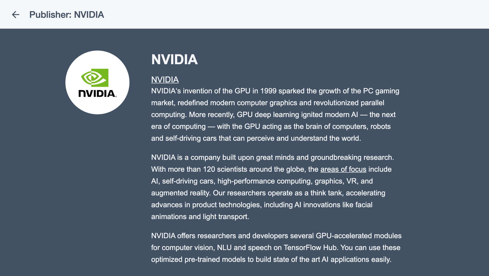
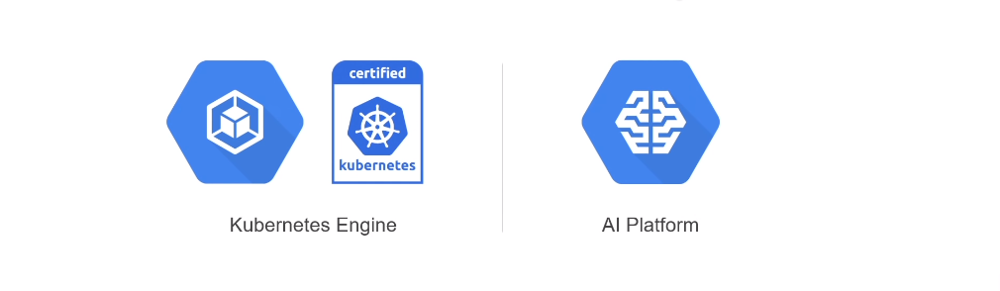

<link rel="stylesheet" href="https://use.fontawesome.com/releases/v5.5.0/css/all.css" integrity="sha384-B4dIYHKNBt8Bc12p+WXckhzcICo0wtJAoU8YZTY5qE0Id1GSseTk6S+L3BlXeVIU" crossorigin="anonymous">

<!-- _class: title -->
# TensorFlow Ecosystem & Enterprise

TensorFlow World Extended Tokyo 2019

---
<!-- _class: about_me -->

# Mitsuhisa Ota

- CDTO @ BrainPad
- Google Developers Expert (ML)
- TFUG Tokyo organizer
- <i class="fab fa-twitter"></i>@ohtaman


---

# TensorFlow World 2019

O'Reilly主催の初のTensorFlowに関するカンファレンス
<small>※ TensorFlow Dev Summit は Google 主催で開発者向けの色の濃いものでした。</small>

- 開催地: Santa Clara Convention Center
- 期間: 2019/10/28 - 2019/10/31


---

# TensorFlow World

<div class="left">

- 10/28 - 10/29: Contributor Summit
- 10/28 - 10/29: Training & Tutorials
- 10/30 - 10/31: Talk Sessions

- 一部の[スライド](https://conferences.oreilly.com/tensorflow/tf-ca/public/schedule/proceedings)と[ビデオ](https://www.youtube.com/playlist?list=PLQY2H8rRoyvxcmHHRftsuiO1GyinVAwUg)は公開済

</div>
<div class="right">

<iframe height="400px" width="600px" src="https://www.youtube.com/embed/MunFeX-0MD8" frameborder="0" allow="accelerometer; autoplay; encrypted-media; gyroscope; picture-in-picture" allowfullscreen></iframe>

</div>

---
# Sessions


様々な立場の方がトークセッションで登壇

- TensorFlow のデベロッパー
- TensorFlow のユーザー企業
  - Microsoft
  - AWS
  - Twitter
- TensorFlow のユーザー
  - TFRCのユーザー
- ...

---

# Networking


ネットワーキングのための工夫が満載

- 5K Fun Run/Walk
  早朝みんなで走るイベント
- Speed Networking
  早朝参加者同士が1対1で話し合う時間を確保
- Topic Tables
  昼食のテーブルごとにトピックが決まっていて似た興味の参加者が自然と集まる仕掛け

---

# Exhibition


TensorFlow Dev Summit と違い、色々な企業が参加

- O'Reilly
- Google Cloud Platform
- Amazon AWS
- Databricks
- ...

---

# TensorFlow World で気になったキーワード

1. TensorFlow 2.0
3. Community / Open Source
2. TensorFlow's Ecosystem

---

# TensorFlow 2.0

- TensorFlow World に先立ち、 9/30 に正式リリース
- シンプルさと使いやすさに主眼をおいた改修
  - Eager Execution
  - Keras API
  - モジュール構成の整理
  - ...
- 具体的な機能については新村さんの発表 & Viewing Party で！

---

# TensorFlow 2.0 の開発体制

TensorFlow2.0 リリースまでの1年で、開発体制が大きく変化

**TensorFlow 1.x**

- あくまで Google が内部で使っているツールを公開したもの
- 機能やリリーススケジュール決める主体はGoogle

**TensorFlow 2.0**

- 11の SIGs(Special Interest Group) を設置し、それぞれが主体的に開発
  - 各 SIG には Googler **以外**のメンバが参加
  - 公開されている RFCベースの開発
- ドキュメント改善もコミュニティー主体

---


---


---

# Docs Translation

Slack上でコミュニケーションを取りながら、ドキュメント翻訳をすすめています！

- 11/18 に [TensorFlowのドキュメントを翻訳しつつ勉強する会 #2](https://tfug-tokyo.connpass.com/event/154341/) を開催します！楽しいので興味のある方はぜひご参加ください！


---

# TensorFlow Ecosystem

機械学習ライブラリとしての TensorFlow を TensorFlow "Core" と呼び、周辺のライブラリや環境を含めて TensorFlow "Ecosystem" と呼ぶことが増えている（気がする）

<center>


<small>※公式ページもライブラリ/フレームワークではなくプラットフォームと表記</small>

</center>

---

# TensorFlow Ecosystem

- TensorFlow Core
- TensorFlow Lite
- TensorFlow.js
- Swift for TensorFlow
- TensorBoard
- TensorFlow Hub
- TensorFlow Extended (TFX)
- ...

---

# TensorFlow2.0対応と新たなライブラリ

- TensorFlow 2.0 対応
  - TensorFlow Probability
  - TensorFlow Agents
  - TensorFlow Text
- 新たなライブラリ
  - Neural Structure Learning
  - Fairness Indicators

<div class="right">


<center><small>Fairness Indicator</small></center>

</div>

---
<!-- _class: subsection -->

# TensorFlow Hub

---

# TensorFlow Hub

- TensorFlow Hub ([https://tfhub.dev](https://tfhub.dev)) には、多数の学習済のモデルが登録されていて、簡単に利用できる
- UI が刷新されて、より使いやすくなった

<center>


</center>

---

# 刷新された TensorFlow Hub のUI


---

# Easy to Use

利用はとても簡単

- モデルのURLを `hub.KerasLayer` に与えると `Keras.Layer` が得られるので、そのまま使っても良いし、独自のモデルの一部分として組み込んでも良い

```python
import tensorflow as tf
import tensorflow_hub as hub

tf.enable_eager_execution()

module_url = "https://tfhub.dev/google/nnlm-en-dim128/2"
embed = hub.KerasLayer(module_url)
embeddings = embed(["A long sentence.", "single-word",　"http://example.com"])
print(embeddings.shape)  #(3,128)
```

---

# Community による貢献

<div class="left">

Google に限らず色々なコミュニティーがモデルを提供している

- DeepMind
- Google
- Microsoft AI for Earth
- NVIDIA
- The Metropolitan Museum of Art
- Global Biodiversity Information Facility
- ...

</div>
<div class="right">



</div>

---
<!-- _class: subsection -->

# TensorFlow Enterprise

---


<div class="right">

- 僕: 「ボス！挙動がおかしいです」
- ボス「原因はなんだ？」
- 僕: 「よくわからないですが、 Slack で聞いてみます！うまくいけば解決するかも！」

</div>

---

# TensorFlow Enterprise

最も多く使用される機械学習フレームワークに成長した TensorFlow をビジネス用途で使うのに不足している部分を、（TensorFlow チームではなく）Google Cloud が補完


1. エンタープライズグレードのサポート
2. クラウド規模のパフォーマンス
3. マネージドサービスの提供

---

# エンタープライズグレードのサポート

<div class="left">

- Long Term Support として、特定のバージョンについて最大3年間バグフィックスとセキュリティパッチを提供
- ホワイトグローブサービスも提供

</div>
<div class="right">

|Package|Version|
|:--|--:|
|TensorFlow|1.15|
|TensorFlow-io|0.8|
|TensorFlow-estimator|1.15|
|TensorFlow-probability|0.8|
|TensorFlow-datasets|1.12|
|TensorFlow-hub|0.6|

</div>

---


---

# クラウド規模のパフォーマンス

TensorFlow を NVIDIA GPU や Cloud TPU 向けに最適化したものを、Deep Learning VM や Deep Learning Container として提供
  - TensorFlow Enterprise による最適化によって、データの読み取り速度が、通常の TensorFlow と比較して最大3倍に

---

# マネージドサービスの提供

AI Platform や Kubernetes Engine などの End-to-End な TensorFlow ワークフローの環境を提供（？）



---


---

# まとめ

1. TensorFlow 2.0 のポイントは「シンプルさと使いやすさ」
2. TensorFlow の開発体制が変わり、よりオープンソースらしくなってきた
3. TensorFlow Ecosystem が充実してきた
   - 新たなライブラリ追加と既存ライブラリの TensorFlow 2.0 対応
   - TensorFlow Hub を使ったお手軽なモデル構築
4. TensorFlow Enterprise でビジネスニーズに応える
   - TensorFlow 1.15 の長期サポート
