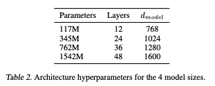
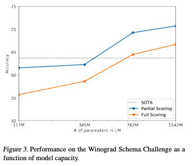

# Language Models are Unsupervised Multitask Learners

## 問い

現在の機械学習システムでは、タスクごとにデータセットを作成し、訓練させている。
様々なケースでうまくいっている一方、キャプション生成や文書読解、多様な入力を受け付けるような画像分類では不規則な挙動を示すことが知られている。
この挙動の原因はタスクごとにデータセットを作成していることではないだろうか？

## 貢献

1. WebText とよばれる巨大なデータセットを作成した
2. WebText で訓練された言語モデルを使って、タスク固有の訓練なしで多くのタスクで SoA を達成できることを示した (zero-shot Learning)

## 他の取り組みとの違い

1. 複数のタスクに対応できるモデルを構築する取り組みとしてマルチタスク学習が挙げられる
    - ただし、複数のタスクに対して十分な訓練データが必要となるのでスケールしない
2. 転移学習（事前訓練とファインチューニング）についての研究が進められている
    - しかし、結局訓練データが必要となる

## アプローチ

いわゆる言語モデルを利用する

$$
p(x) = \prod _{i=1}^{n}p(s_{n}|s_,\dots,s_{n-1})
$$

ただし、複数のタスクに対応するには、タスクごとに予測値が変わる必要がある

$$
p(\mathrm{output}|\mathrm{input})\to p(\mathrm{ouytput}|\mathrm{input},\mathrm{task})
$$

既存の手法では、タスクを埋め込むための構造を別途用意していたが、言語モデルの場合は、以下の様に、条件づけを文章で表現できる(McCann et al., 2018[^1])

- 翻訳の場合
    (translate to french, english text, french text)
- 文章読解の場合
    (answer the question, document, question, answer)

質問応答の分野では、教師データを使うのではなく自然文の後続語の予測を利用して訓練する研究がすすめられている

十分に大きなモデル（とデータ）を使えば、質問応答以外の分野でも同様に後続語予測を使えるのではないか、そうであれば、それは教師なしのマルチタスク学習ということになるのではないだろうか.

[^1]: McCann, B., Keskar, N. S., Xiong, C., and Socher, R. The natural
language decathlon: Multitask learning as question answering.
arXiv preprint arXiv:1806.08730, 2018.

## モデルアーキテクチャ

GPTに微修正を加え、パラメータ数を多くしたものを利用する

### GPT からの変更点

1. Layer Normalization を各ブロックの先頭に
2. その分、最終層の attention の後ろに Layer Normalization を追加
3. 係数の初期化時に $1/\sqrt N $ ($N$ は Residual 層の数) でリスケール(?)
4. ボキャブラリサイズは 50,257
5. コンテキストサイズを 512 から 1024
6. バッチサイズは 512
7. レイヤ数をかえたいくつかのモデルを用意

### 入力データの取り扱い

- BPE （Byte Pair Encoding） を用いる
    - 汎用的なものを作りたいので、既存の言語モデルで行っている、大文字から小文字への変換やトークナイズ等の（言語・分野固有の）前処理はしたくない
    - 文字ベースだと、単語ベースに精度で負けてしまう
- UTF-8 をバイト列として扱う
    - 英語以外も含めて処理したいが、 Unicode そのもの (UTF-16)だと基本語彙が 130,000 を超えてしまう
- ただし、BPEをそのまま（バイト列に）適用すると、不適切なマージが発生してしまうことが知られている
    - ユニコードのカテゴリ情報を使って、カテゴリの違う文字同士は結合しないような工夫をした

## データセット

- Wikipedia やニュース記事などの特定の分野のデータセットでは汎用性の研究にならない
- CommonCrawl はたしかに巨大だが、質が悪いことが知られている
- そこで、自分たちで Webスクレイピングを行った
    - 質を担保するために、Reddit からのアウトバウンドリンクで、 3karma 以上と評価されたものから始めた
    - HTMLからのテキスト抽出には Dragnet と Newspaper1 content extractors を利用
- 結果、 40GBで800万ドキュメントのデータとなった

## 実験

### 言語モデル

評価に用いたデータセットは <UNK> を含んでいたり、文レベルでシャッフルされていたり、正規化されていたりしているにもかかわらず、 7/8 で SOTA を超えた

唯一 SOTA を超えられなかった 1BW は、文レベルでシャッフルされているデータセットのため、長距離構造が保持されていないものである

### LAMBDA

- LAMBDA データセットとは
    - 長期依存関係をモデル化できるかを検証するためのデータセット
    - 人間が正しく予測するのに50単語以上必要となるような長文の最後の単語を予測する
- Perplexity は前述の通り（99.8 > 8.63）
- 単語予測の精度は 59%[^2] > 52.66%
    - GPT2 は '文の最後' をうまく認識していないようなので、ストップワードフィルタ（. につながるものだけを採用？）を追加 > 63.24%

[^2]: 論文では 19% と書かれていた

### Winograd Schema Challenge

-  Winograd Schema Challengeとは
    - 曖昧正解消のデータセット

- GPT-2 は SOAT を 7% 向上
    - ただし、データセットが小さい（273 サンプル）ので、 Trichelair et al. (2018) を参照のこと

### Reading Comprehension

- CoQA データセット
    - 7つの異なるドメインからのドキュメントと、そのドキュメントに関する質問者と回答者の対話
    - 文章読解と、会話履歴に依存するような質問（Why? など）

- GPT-2 では、 会話履歴を読み込ませたあとで、「A:」で条件づけする
    - F1値 55 でベースラインと同等程度
    - 教師ありの SOTA は BERT ベースのモデルで、 F1値 89 なので遠く及ばない
- 結果を見ると、 GPT-2 はドキュメントに出てくる人名をそのまま返すようなヒューリスティクスを用いることが多い様子

### Summarization

- CNN and Daily Mail データセット
    - 要約用のデータセット
- GPT-2 では、記事の後に TL; DR：を追加して条件付け
    - 同じ単語が繰り返されるのを避けつつ、より抽象的な要約となる（？）
    - 複数の文章を生成するため、 k=2 の Top-k サンプリングで 100 トークン生成。はじめの3文を要約とした
    - ROUGE 1,2,L で評価すると、古典的なニューラルネットによるものに近く、3文をランダムに取得した場合を若干上回る程度

### Translation

- WMT-14
    - 英語からフランス語への翻訳
    - フランス語から英語への翻訳
- GPT-2 では、以下の形式で文をいれることで条件づけする
    - <英文> = <フランス文>, <英文> =
    - 英語 > フランス語では、結果は 5 BLEU で、 Word-by-Word の置換による方法よりも少し悪い程度
    - フランス語 > 英語では、 11.5 BLEU で、いくつかの教師なし手法を上回るが、SOTAの 33.5 BLEU には遠く及ばない

ただし、実はコーパスを作る際に英語以外のテキストを意図的に除外していた（非英語はたかだか10MB）ので、驚くべき結果である

### Question Answering

- SQUAD.3 と Natural Questions データセット
    - ファクトイド型の質問応答データセット
- GPT-2 は、シードとして、質問回答のペアを入力する
    - SQUAD.3 で 4.1%（ちいさなモデルでは 1.0% 以下なので、まだまだモデルサイズが小さすぎると考えられる）
    - Confidence の高い 1% にしぼれば、 63.1% になる
    - 最近の手法では 30〜50%なので、GPT-2 ははるかに劣っている

## データセットの問題

最近の研究で、画像データセットには、テストセットと訓練セットでかなりの量の画像が重複していることが知られている。WebText は大丈夫だろうか？

Bloom Filter を使って、評価用データセットの 8-gram が WebText に含まれていないか調査した
- WebText との重複もあるが、同一データセットの訓練データとの重複が多い

### 用語の確認

- ROUG / BLEU
    - https://qiita.com/amtsyh/items/a926b79b90dfabe895e9
