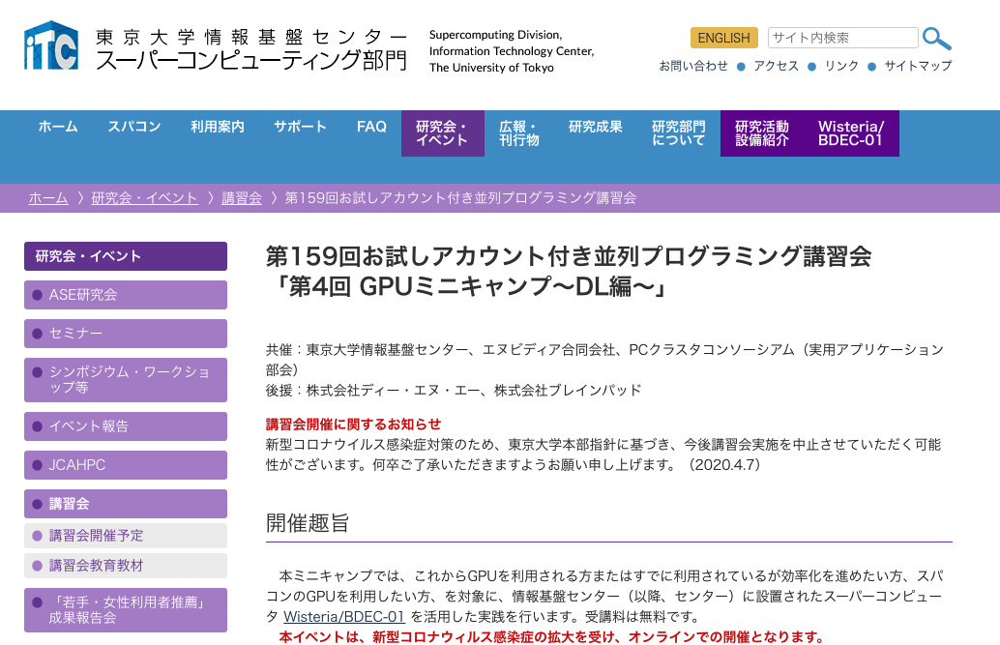
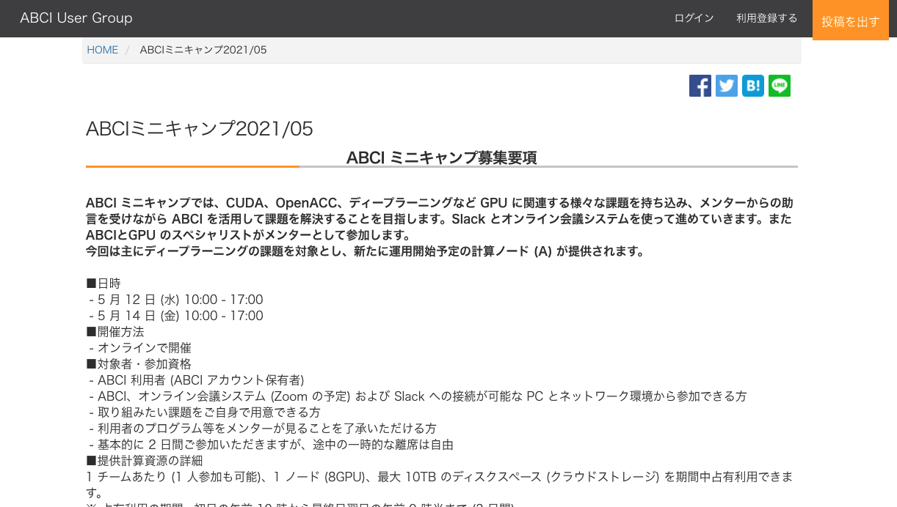
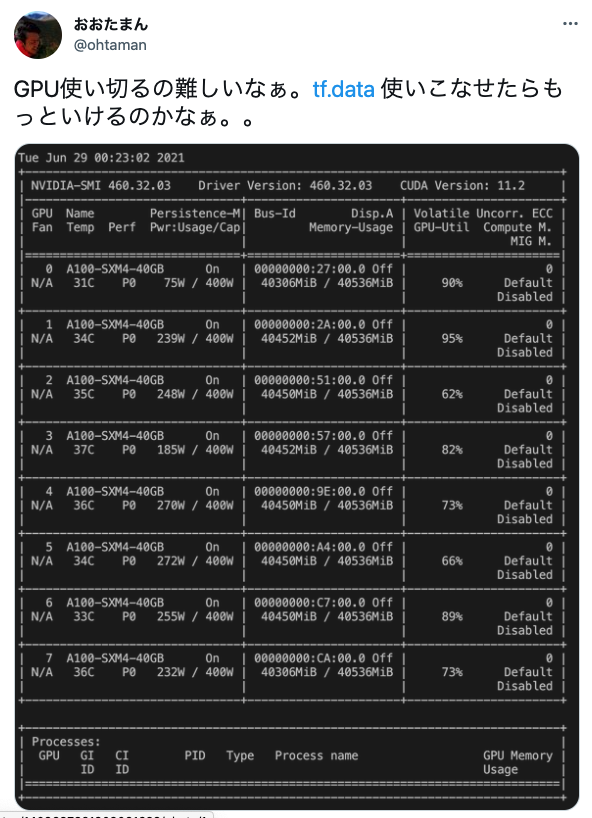
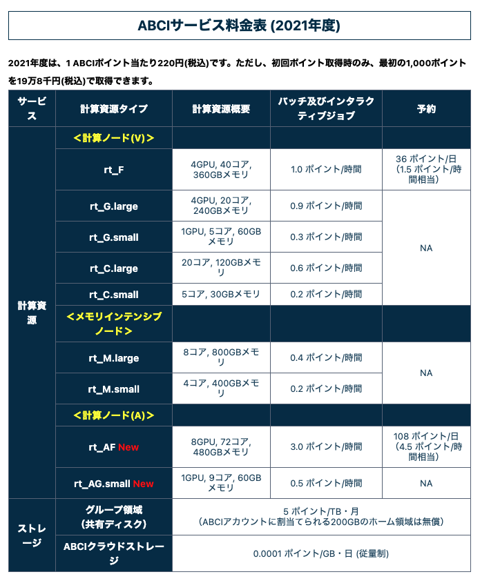
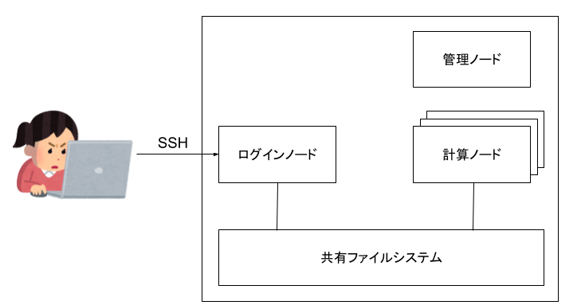

<style>

section {
    background-color: white;
}

section.with_img {
    padding-right: 420px;
}

section.with_img img {
    position: absolute;
    left: 900px;
}

strong {
    color: red;
}

h1 {
    position: absolute;
    left: 72px; top: 100px;
}

section.title h1 {
    position: relative;
    top: 0px;
    left: 0px;
}

</style>

<!-- _class: title -->

# はじめてのHPCによる深層学習<br>〜スーパーコンピューターに触れてみる〜
<b>ohtaman</b>
第61回 Machine Learning 15minutes! V-expo (2021/11/27)


---
<!-- pagination: true -->
<!-- _class: with_img -->

# 自己紹介

### 太田 満久 (ohtaman)
- CDTO (Chief Data Technology Officer) at BrainPad Inc.
- Google Developers Expert (Machine Learning).
- An organizer of TensorFlow User Group Tokyo.


---


https://www.cc.u-tokyo.ac.jp/events/lectures/159/

---


https://abciug.abci.ai/minicamp202105-p53


---

# GPUミニキャンプを通じて知ったこと

1. スパコンは特殊な装置ではない。使い方さえ知っていれば、案外簡単に使える。
2. スパコンは学術研究以外にも使える（利用規約や運用方針による）。
3. スパコンは思っていたよりも安い。

---

# スパコンを使うメリット

1. 大量のマシンによる並列分散処理で、モデルの訓練時間を短縮できる
2. クラウドサービスよりも安価に利用できる



---

# 参考: ABCI の料金体系

- ポイント制（1ポイント220円）
- 3.0ポイント/時間 
   (A100x8, 72コア, 480GBメモリ, 2021年度の料金設定)



---

# スパコンを使うメリット

1. 大量のマシンによる並列分散処理で、モデルの訓練時間を短縮できる
2. クラウドサービスよりも安価に利用できる

**でも、利用イメージがわかないので始められない...**


---


## というわけで、主に深層学習のモデル構築を想定したスパコン（HPC）の利用イメージを紹介します


---

# 覚えておくと良さそうなこと

1. ジョブスケジューラー
2. Environment Modules

---

# 覚えておくと良さそうなこと

1. **ジョブスケジューラ**: 複数人からの依頼に応じてリソースの割り当てを行う
2. Environment Modules

---

# システムの全体像



---

# システムの全体像

1. ログインノード
   ユーザーがログインして各種設定やジョブの投入を行う
2. 計算ノード
   ジョブを受け取り、計算を行う
3. 管理ノード
   リソースやキューの管理を行う


---

# ジョブ実行の流れ

1. ログインノードにログイン
2. 計算に必要なファイルの準備
3. (optional) インタラクティブジョブで動作確認
4. バッチジョブを実行
5. 結果の確認


---


ABCIシステムの概要: https://docs.abci.ai/ja/system-overview/

---

# 覚えておくと良さそうなこと

1. ジョブスケジューラ: 複数人からの依頼に応じてリソースの割り当てを行う
2. **Environment Modules**: 利用するライブラリの管理を行う

---

# Environment Modules の利用例

`module` コマンドを用いて、使いたいライブラリの使いたいバージョンをロード

```bash
$ module avail  # 利用可能なモジュールの確認
-------------------- /usr/share/Modules/modulefiles ---------------------
dot  module-git  module-info  modules  null  use.own  

------------------------ /usr/share/modulefiles -------------------------
mpi/mpich-x86_64
```
``` bash
$ module load mpi # モジュールのロード
$ module list # ロード済みモジュールの確認
Currently Loaded Modulefiles:
 1) mpi/mpich-x86_64  
```

---

## でも、触ってみないと実感が湧かないよ...

---

## ということで、疑似環境を用意しました

https://github.com/ohtaman/docker-compose-hpc

---

# docker-compose-hpc

- docker-compose による構成
- ホストのディレクトリを共有
- OpenPBS の利用
- Environment Modules の利用

<center>


</center>


---

# クラスタの構築

```bash
host$ docker-compose up -d
```

---

# ログイン

ログインノード（login）が SSH を待ち受けている

```bash
host$ docker-compose ps  
            Name                        Command            State          Ports        
---------------------------------------------------------------------------------------
docker-compose-hpc_compute_1   /bin/sh -c /entrypoint.sh   Up                          
docker-compose-hpc_head_1      /bin/sh -c /entrypoint.sh   Up                          
docker-compose-hpc_login_1     /bin/sh -c /entrypoint.sh   Up      0.0.0.0:2022->22/tcp
```

ホストのユーザー名でログインノードにログイン

```bash
host$ ssh -i ssh/id_rsa -p 2022 localhost
```

---

# ジョブの実行

スクリプトの中身を確認

```bash
$ cat mnist.sh
#!/bin/sh
#PBS -q workq
#PBS -l nodes=1:ppn=1
#PBS -l mem=2G

# qsubを実行したディレクトリに移動
cd "${PBS_O_WORKDIR:-$(pwd)}"

source .venv/bin/activate
python mnist.py
```

---

# ジョブの実行

`qsub` コマンドでジョブを送信

```bash
$ qsub job.sh
```

`qstat` コマンドでジョブの状態を確認。実行中のジョブがない場合は何も表示されない。

```bash
$ qstat
Job id            Name             User              Time Use S Queue
----------------  ---------------- ----------------  -------- - -----
0.head            job.sh           ohtaman           00:00:00 R workq    
```

---

# 計算ノードの追加

docker-compose なので、計算ノードを（仮想的に）好きなだけ追加できる

```bash
host$ docker-compose up -d --scale compute=2 
```


```bash
host$ docker-compose ps  
            Name                        Command            State          Ports        
---------------------------------------------------------------------------------------
docker-compose-hpc_compute_1   /bin/sh -c /entrypoint.sh   Up                          
docker-compose-hpc_head_1      /bin/sh -c /entrypoint.sh   Up                          
docker-compose-hpc_head_2      /bin/sh -c /entrypoint.sh   Up                          
docker-compose-hpc_login_1     /bin/sh -c /entrypoint.sh   Up      0.0.0.0:2022->22/tcp
```

---

# MPI による分散処理


MPI を用いると、複数の計算ノードで並列計算できる (以下の例では `nodes=2:ppn=2` で2ノードで2プロセスずつ実行するよう指定)

```bash
$ cat mpi.sh
#!/bin/sh
#PBS -q workq
#PBS -l nodes=2:ppn=2
#PBS -l mem=2G

module load mpi
mpirun hostname
```

---

# MPI による分散処理

ログを見ると、2つの計算ノード（572085e2d423, f565b6b4a09b）それぞれで2プロセスずつ実行されていることがわかる

```bash
$ qsub mpi.sh
... (ジョブが終了するまで待機する)
$ cat mpi.sh.o1 
572085e2d423
572085e2d423
f565b6b4a09b
f565b6b4a09b
```

---

# Optuna による並列分散最適化

機械学習で複数ノードを利用する場合、1つのモデルを複数ノードで訓練することもできるが、パラメーター探索などで大量のモデルを構築したい場合は、各ノードにモデルを割り当て、それぞれ独立に訓練すると、実装がシンプルになる。

---

# Optuna による並列分散最適化

Optuna を使って MPI を用いたパラメーター探索を行う場合は、以下のように適切な storage を指定するだけ


```python
def main():
    # Optuna で分散並列最適化を行うには、storage を指定する
    # https://www.slideshare.net/pfi/20201023-optunalectureatnagoyauni-238946529
    study = optuna.create_study(
        direction='maximize',
        storage='sqlite:///db.sqlite3',
    )
    study.optimize(objective, n_trials=5)
...
```
<small> ※ SQLite ではなく PostgreSQL の方が安心 </small>

---

# スパコン利用の注意点

1. 個人利用はできないことが多い（利用規約や運営方針による）
2. 初期費用（最低のチャージ）が発生することがある
3. 一般のクラウドサービスと異なり、サービング環境はないため訓練のみ利用可能
4. グランドチャレンジなど優先的なプロジェクトがあるため、常時実行するようなジョブには向いていない

---

# まとめ

1. スパコンは民間利用もできて、安い。使い方も難しくない。
2. 体験していただけるように docker-compose で疑似環境を作ってみたので触ってみてね

---

# 参考資料

- [docker-compose-hpc](https://github.com/ohtaman/docker-compose-hpc)
  - スライドで紹介した疑似環境
- [一週間でなれる！スパコンプログラマ](https://kaityo256.github.io/sevendayshpc/)
  - MPIやスパコンの基本からわかりやすく解説している記事
- [ABCI 2.0 User Guide](https://docs.abci.ai/ja/)
  - ABCI (AI橋渡しクラウド) のユーザーガイド
- [不老におけるOptunaを利用した分散ハイパーパラメータ最適化 - 今村秀明（名古屋大学 Optuna講習会）](https://www.slideshare.net/pfi/20201023-optunalectureatnagoyauni-238946529)
    - Optuna の紹介スライド
