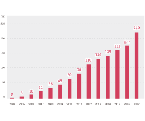
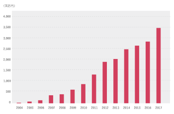

<link rel="stylesheet" href="https://use.fontawesome.com/releases/v5.5.0/css/all.css" integrity="sha384-B4dIYHKNBt8Bc12p+WXckhzcICo0wtJAoU8YZTY5qE0Id1GSseTk6S+L3BlXeVIU" crossorigin="anonymous">

# データ分析とベンチャーと上場とキャリアの話

---

# あなただれよ？

- BrainPad
  - Chief Data Technology Officer
- Google Developers Expert (ML)
- JDLA試験委員
- コミュニティーのオーガナイザ
  - TensorFlow User Group
  - Optimization Night
- <i class="fab fa-twitter"></i>@ohtaman

---

# 略歴

Java開発、機械学習、研究開発、マネージメント、諸々を経験

- 2010年 BrainPad に新卒入社（開発エンジニア）
- 2012年 自然言語処理チームリーダー
- 2014年 技術戦略部 部長
- 2017年 AS本部副本部長
- 2019年 CDTO (Chief Data Technology Officer)

---

# BrainPadの沿革

「データ活用の促進を通じて持続可能な未来を作る」

- 2004年 創業
  受託分析サービスの提供開始
- 2006年
  DMP「Rtoaster」を提供開始
- 2011年 東証マザーズ上場
- 2013年 東証一部上場

---

# 従業員数

従業員数は入社時の5倍になった

- 2010年: 60名
- 2019年: 306名
（グラフは2017年まで）

---

# 売上推移

売上は入社時の7倍になった

- 2010年: 約8億
- 2019年: 約56.7億
（グラフは2017年まで）

---

## 新卒でベンチャーに入って上場も経験して、実際どうだったか、という話をしようと思います。サンプル数1なので、一般的な話はできませんが、キャリアを考える参考にしていただければと思います。

---

# ベンチャー時代のBrainPadに惹かれた理由

1. 「もっとデータを活用しよう」という思想に強く共感
2. 上場準備中だったため、上場を体験できる（可能性のある）よい機会だと思った
3. 若いうちに「泥臭いこと」を経験しておきたいと考えた

---

# 10年前の BrainPad

当時のBrainPadは、すべてにおいて試行錯誤していた時代

- 組織は半年ごとに変わる
- 残業はとても多い（電気を消す人事と、すぐにつけ直すメンバ）
  - 残業代はきっちり全部出た
- エンジニアや分析官のバックグラウンドやスキルはバラバラ
- よって製品や担当メンバによってコードの品質に差がある
- （伝聞ですが）上場準備の関係で、理想を求める雰囲気から売上重視に
- 経営陣との密なコミュニケーションが取れる

---

# ベンチャーを選んで良かったのか？

個人的には良かったが、人によって合う合わないがある。BrainPadは上場準備をしていて、ある程度規模も大きくなっていたが、小さすぎるベンチャーだと、リスクも大きい。

1. メンバについて
    - 今のほうが断然**優秀**な人が多い
    - 昔のほうが**多様性**があって面白かった
2. 組織について
    - 昔はマネジメントの専任はいないし制度も整っていなかった。
    - 管理されない分自由だが、責任も大きい。
3. 仕事内容について
    - 明らかに、今のほうが大きな仕事をとりやすい。

---

# お金のはなし

福利厚生を含めると、なかなか大手には勝てない。
株やストックオプションで一攫千金を狙うのであれば、リスクをとってかなり初期に入社しないと意味がない。とはいえ、BrainPadの株価は10倍くらいになっているので、少し特殊な状況。

---

# 経営陣との距離感

個人的に、ベンチャー時代に入って一番良かったのは、「経営陣との距離感が近い」こと。実際にリスクをとって会社を立ち上げて経営している人の話はとても刺激的だし、面白い。

1. 新卒の担当するプロジェクトに、社長が直接アドバイスをくれる
2. ビジネス書の輪読会を通じて、社長の考えにふれることができる
3. 定期・非定期な飲み会で、何を考えているのか知ることができる
4. etc

---

# Quick & Dirty

入社数年後に経営陣（会長）に言われた言葉。とても重要。

- 完璧である必要はないので、早くアウトプットを出すスタイルのこと
- フィードバックを多く貰えるので、結果的にアウトプットの質が向上する
- 早くフィードバックを貰えるので、安心して仕事ができる

自分はなんだかんだ言ってプライドが邪魔をするので、常に意識するようにしている。

---

# プレーヤーからマネジメントへ

入社2年後にリーダー、入社4年で部長に。リーダー1年目は、難しい内容は部下にほとんど任せずに、ほとんどすべて自分で実装。

- 部下に任せないで自分でやったほうが早いし質も上がる
- 自分ができることを部下ができないとイライラする
- 結局部下は違う会社に...

---

# 「株式会社おおたまん」だと思ってやってみな

散々な状況だったときに、上司に言われた言葉。解釈は人によって違いそうですが、個人的には「もっと自由に考えな」ということ。

- 何をしたいのかを本気で考える
- そのために何ができるのかを本気で考える
  - たいていの場合、新米マネージャは自分が思っている以上に自由が与えられている。できることが沢山あるけど気づけていない。

---

# AIブームの到来

AIブームが到来し、競合他社が増える中で「BrainPadの強みである総合力をもっと伸ばさねば」と思った

- 開発と分析の両方ができる人材は少ない
- 両方できる人材を育てるのではなく、連携しやすくするのが大事では？

---

# 人をつなぐことの面白さ

データサイエンティストとエンジニアだけでなく、ビジネスサイドの人や研究者など、専門分野の異なる人たちをつなげるのは面白い

- 自分よりも詳しい人の価値観に触れることができる
- 自分自身が専門家でなくても、価値を提供できる

---

# コミュニティ活動

TensorFlow User Group をきっかけに、コミュニティ活動をいくつか開始

- TensorFlow User Group 主催イベントの開催
- Google Developers Expert として登壇
- QCX で量子コンピューター関連イベントの開催サポート

---

# 好循環の自己強化ループに自分を巻き込む

好循環の自己強化ループがある場合、一歩踏み出すのが大事。

---

# まとめ

就職して10年間を振り返ってみて、今の自分に大きな影響を与えてくれたのは

1. Quick & Dirty
2. 「株式会社おおたまん」だと思ってやってみな
3. 人をつなぐ面白さ

若い皆さんの参考になれば！

---

# 質問ありますか？